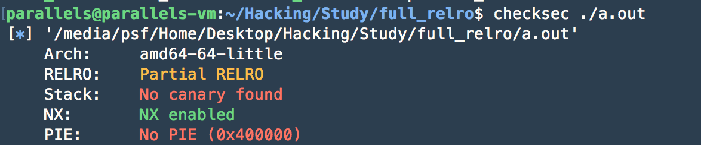
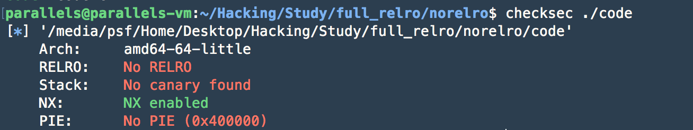
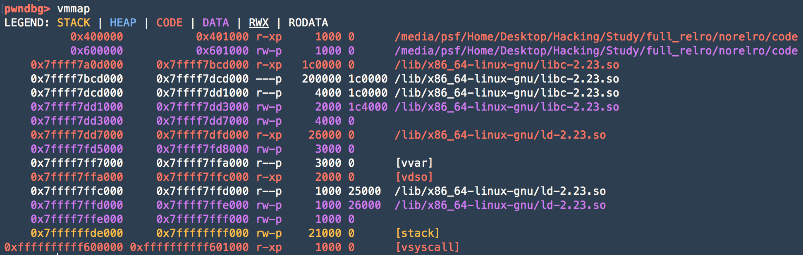
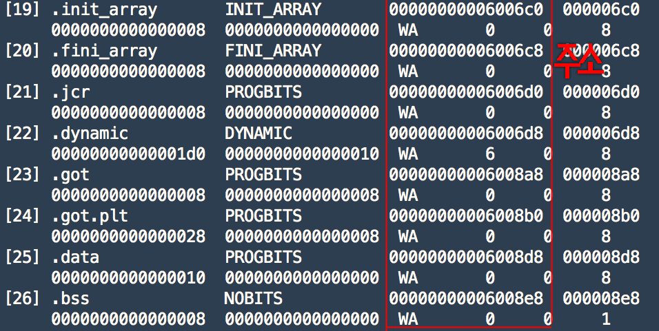
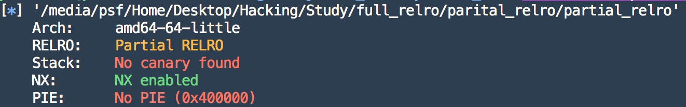
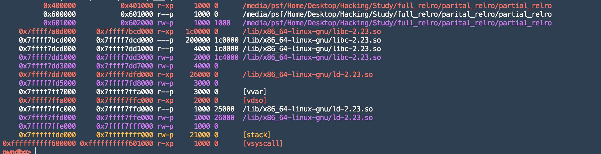
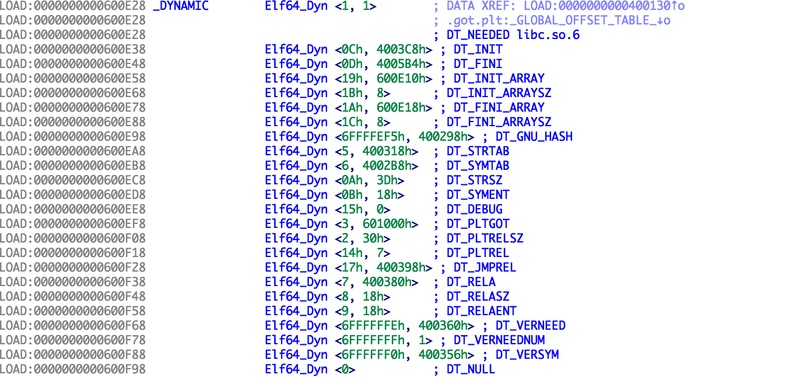
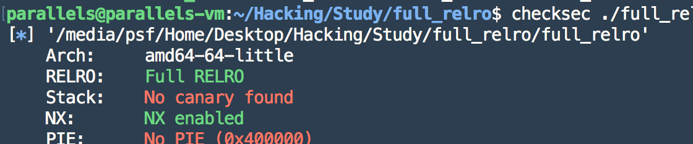
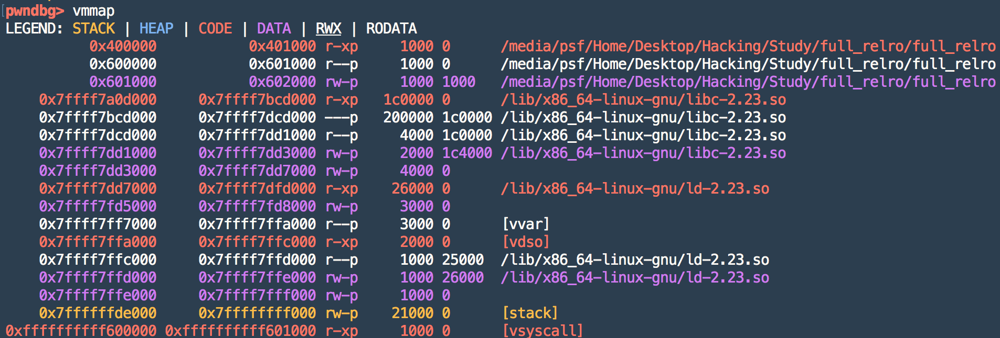
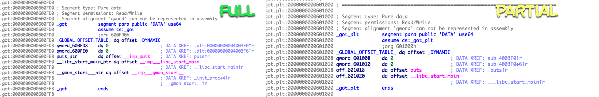

---

layout: post
title: RELRO를 파헤치자 1!
author: hOwDayS
---

<br>

짧게만 느껴졌던 2018년이 지나가고 2019년을 맞이했습니다!

모두 2019년에는 좋은 일 가득 하시길 바랍니다~~ (_ _)

<br>

아직 많이 부족합니다 T_T ,,, 

틀린 부분이 있으면 howzinuns@gmail.com 이나 https://www.facebook.com/hOwDays 로 연락을 주시면

스르륵 삭삭 고쳐 드리겠습니다!

기초적인 내용부터 심화적인 내용까지 다루고 있습니다

<br>

이 글을 보기전

pwndbg https://github.com/pwndbg/pwndbg 설치하는 것이 매우 편합니다

 https://bpsecblog.wordpress.com/2016/03/07/about_got_plt_1/

https://bpsecblog.wordpress.com/2016/03/09/about_got_plt_2/

https://bpsecblog.wordpress.com/2016/05/16/memory_protect_linux_1/

https://bpsecblog.wordpress.com/2016/05/18/memory_protect_linux_2/

을 보는 것이 이해에 도움이 많이 되실 겁니다!!

<br>

<h1>RELRO!! WHO ARE YOU!</h1>

포너블하시다 보면 바이너리에 어떤 보호기법이 걸려있냐에 따라 접근 하는 방법이 매우 달라집니다.

예를 들어



checksec 에도 많은 사람들이 만든 파일들이 있지만 기본적인 기능은 위사진 같이 바이너리에 걸려있는 보호기법을 알려줍니다.

저는 여기서 RELRO라고 있는 신비로운(?)에 대해 쓸겁니다!

<br>

RELRO 은 Relocation Read-Only의 약자로 바이너리의 symbol 및 got 등에 보호기법을 거는 것을 말합니다.

RELRO는 크게 3가지가 있습니다.

NO RELRO , Partial RELRO , FULL RELRO 오른쪽부터 취약한 순서대로 입니다.

이제 RELRO의 특징과 , 라이브러리 로딩방식을 모두 살펴보도록 하죠!

<br>

<h1>NO RELRO</h1>

No RELRO 는 ELF 기본헤더 , 코드영역 를 제외한 거의 모든 부분에 Read , Write 권한을 주는 것입니다.

직접 테스트를 하죠!@#!

code.c

```c
#include <stdio.h>

int main()
{
    printf("NO RELRO!! \n");
    return 0;
}
```

$ gcc -o ./code ./code.c -z norelro

<br>

컴파일을 했으면 checksec을 해봅시다!



잘 적용 된 것을 볼 수 있습니다. 이제 gdb를 키고 직접 확인 해보죠!

$ gdb ./code

**pwndbg>** b*main (main의 도입부분 breakpoint!)

**pwndbg>** r (시작!)

**pwndbg>** vmmap (프로그램 메모리 상태 확인 및 권한확인!)

모두 여기까지 쉽게 스르륵 하시면 됩니다!.

이제 vmmap을 하시면



뭔가 많은 것이 나오는데 저희는 여기서 위에 두줄

__0x400000           0x401000  r-xp __ <— 코드영역 및 ELF Header! 읽기 및 실행권한만 줌! 

__0x600000           0x601000 rw-p __ <— got , bss , _DYANAMIC 등! 읽기 , 쓰기권한만 줌!

__got , bss , _DYANAMIC__ 이게 뭐야?!

$ readelf -S ./code

뭔가 쭈루룩 나오실겁니다.

여기서 0x600000 ~ 0x601000 이 부분만 짤라서 봅시다.



위에 빨간색으로 네모난 부분이 범위안에 들어가는 주소들이고 맨 왼쪽이 이름입니다.

NO RELRO는 저 모든 부분을 Write & Read 할 수 있는 권한이 있습니다,, 매우 취약합니다.

 <br>

<h1>Partial RELRO</h1>

Partial RELRO 는 NO RELRO와 매우 비슷하지만 차이점이 있다면 _DYNAMIC 섹션에 쓰기 권한이 없어집니다.

<br>

partial_relro.c

```c
#include <stdio.h>

int main()
{
	printf("Partial RELRO! \n");
	return 0;
}
```

$ gcc -o ./partial_relro  partial_relro.c -Wl,-z,relro

컴파일을 했으니 checksec으로 이용해 확인해보도록 하죠.

<br>

$ checksec ./partial_relro



<br>

$ gdb ./partial_relro

**pwndbg>** b*main

**pwndbg>** r

**pwndbg>** vmmap



아까 말했던대로 _DYNAMIC 섹션에 write 권한이 없어졌기 때문에 

중간에 한줄이 추가 되었죠!!



Partial RELRO는 NO RELRO와 다른점이 많이 없어서 분량이 짧네요 ㅠㅠ

<br>

<h1>FULL RELRO</h1>

FULL RELRO 매우 강합니다!! bss 영역을 제외한 모든 부분에서 write권한이 없어집니다!!!!

<br>

full_relro.c

```c
#include <stdio.h>

int main()
{
printf("FULL RELRO!!! \n");
return 0;
}
```

$ gcc -o ./full_relro  full_relro.c -Wl,-z,relro,-z,now

gogo checksec !!

<br>

$ checksec ./full_relro



적용이 잘 되었습니다!

<br>

$ gdb ./full_relro

**pwndbg>** b*main

**pwndbg>** r

**pwndbg>** vmmap



며용?! Partial RELRO랑 __0x600000 ~ 0x601000__의 권한을 없앤건 같고  vmmap 결과도 같고 뭐가 다른거지?

<br>



<br>

(글씨가 작아서 죄송합니다 ㅠㅠ)

오른쪽이 FULL RELRO , 왼쪽이  , PARTIAL 입니다

눈치채셨나요?! 

Partial RELRO에는 __0x600000 ~ 0x601000__  에는 got 이 있지만

FULL RELRO에는 __0x600000 ~ 0x601000__  에는 got 이 없습니다!

<br>

FULL RELRO에서 __0x600000 ~ 0x601000__의 권한을 없앤다는건 got영역 까지도 write권한이 없어졌다 ~

즉 FURLL RELRO 매우 강하다!

**got == 함수 라이브러리 주소를 담고있는 영역

<br>

다음글에서는 RELRO 마다 라이브러리를 불러오는 방식의 차이를 볼까욧?!

<br>