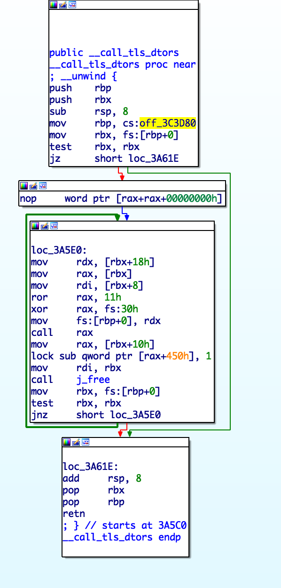

<br>

본 글은 pc에 최적화가 되어있습니다

<br>

exit.c 

```c++
#include <stdio.h>
#include <stdlib.h>
#include <unistd.h>
#include <sysdep.h>
#include "exit.h"

#include "set-hooks.h"
DEFINE_HOOK (__libc_atexit, (void))


void
attribute_hidden
__run_exit_handlers (int status, struct exit_function_list **listp,
		     bool run_list_atexit, bool run_dtors)
{
  /* First, call the TLS destructors.  */
#ifndef SHARED
  if (&__call_tls_dtors != NULL)
#endif
    if (run_dtors)
      __call_tls_dtors ();

  /* We do it this way to handle recursive calls to exit () made by
     the functions registered with `atexit' and `on_exit'. We call
     everyone on the list and use the status value in the last
     exit (). */
  while (*listp != NULL)
    {
      struct exit_function_list *cur = *listp;

      while (cur->idx > 0)
	{
	  const struct exit_function *const f =
	    &cur->fns[--cur->idx];
	  switch (f->flavor)
	    {
	      void (*atfct) (void);
	      void (*onfct) (int status, void *arg);
	      void (*cxafct) (void *arg, int status);

	    case ef_free:
	    case ef_us:
	      break;
	    case ef_on:
	      onfct = f->func.on.fn;
#ifdef PTR_DEMANGLE
	      PTR_DEMANGLE (onfct);
#endif
	      onfct (status, f->func.on.arg);
	      break;
	    case ef_at:
	      atfct = f->func.at;
#ifdef PTR_DEMANGLE
	      PTR_DEMANGLE (atfct);
#endif
	      atfct ();
	      break;
	    case ef_cxa:
	      cxafct = f->func.cxa.fn;
#ifdef PTR_DEMANGLE
	      PTR_DEMANGLE (cxafct);
#endif
	      cxafct (f->func.cxa.arg, status);
	      break;
	    }
	}

      *listp = cur->next;
      if (*listp != NULL)
	/* Don't free the last element in the chain, this is the statically
	   allocate element.  */
	free (cur);
    }

  if (run_list_atexit)
    RUN_HOOK (__libc_atexit, ());

  _exit (status); 
}


void
exit (int status)
{
  __run_exit_handlers (status, &__exit_funcs, true, true);
}
libc_hidden_def (exit)
```

<br>

exit함수는 exit.h 에서 정의된 __run_exit_handlers 를 호출합니다.

```c++
extern void __run_exit_handlers (int status,
				 struct exit_function_list **listp,
				 bool run_list_atexit, bool run_dtors)
  attribute_hidden __attribute__ ((__noreturn__));
```

```
 ► 0x7ffff7521040 <exit+16>       call   __run_exit_handlers <0x7ffff7520f10>
        rdi: 0xffffffff
        rsi: 0x7ffff78ab5f8 (__exit_funcs) —▸ 0x7ffff78acc40 (initial) ◂— 0x0
        rdx: 0x1
```

인자는 위 처럼 들어간다는 것을 알 수 있습니다.

<br>


```c++
struct exit_function_list
  {
    struct exit_function_list *next;
    size_t idx;
    struct exit_function fns[32];
  };
```

exit_function_list 구조체에서 다음 구조체를 가르키는 포인터가

있는 걸로 보아 exit_function_list는 linked-list 로 구성되어있다는 것을 알 수 있습니다.

( exit_function fns 생략 )

<br>

도입부분을 보게되면 __call_tls_dtors 를 실행합니다

```c++
#ifndef SHARED
  if (&__call_tls_dtors != NULL)
#endif
    if (run_dtors)
      __call_tls_dtors ();
```




__call_tls_dtors 를 내부를 보게 되면 0x3c3d80에서 값을 가져오고

```python
>>> ror17 = lambda x : ((x << 47) & (2**64 - 1)) | (x >> 17)
>>> hex(ror17(fs:[off_3C3D80]) ^ fd:0x30)
```

```
출처 - https://github.com/SPRITZ-Research-Group/ctf-writeups/tree/master/0x00ctf-2017/pwn/left-250
```

이러한 연산 후 나온 함수 주소를 호출 합니다. 

그리고 다음 값이 없을 때까지 반복문이 돌기때문에 저곳은 vtable 이라고 유추 할 수 있습니다.

<br>

다시 exit함수로 넘어와서 밑에 while문을 보도록 합시다.

<br>

잠깐 while문의 앞과 뒤를 봐봅니다.

```c++
struct exit_function_list *cur = *listp;
```

```c++
*listp = cur->next;
```

이 두줄의 코드를 보면 linked list로 된 exit_function_list를 하나 씩 cur이라는 변수에 넣어주고 있다는 걸 알 수 있습니다.

 <br>

```c++
  &cur->fns[--cur->idx];
	  switch (f->flavor)
	    {
	      void (*atfct) (void);
	      void (*onfct) (int status, void *arg);
	      void (*cxafct) (void *arg, int status);

	    case ef_free:
	    case ef_us:
	      break;
	    case ef_on:
	      onfct = f->func.on.fn;
#ifdef PTR_DEMANGLE
	      PTR_DEMANGLE (onfct);
#endif
	      onfct (status, f->func.on.arg);
	      break;
	    case ef_at:
	      atfct = f->func.at;
#ifdef PTR_DEMANGLE
	      PTR_DEMANGLE (atfct);
#endif
	      atfct ();
	      break;
	    case ef_cxa:
	      cxafct = f->func.cxa.fn;
#ifdef PTR_DEMANGLE
	      PTR_DEMANGLE (cxafct);
#endif
	      cxafct (f->func.cxa.arg, status);
	      break;
	    }
```

전 cur의 idx의 exit_function을 불러와 flavor에 따라 분류하는 코드입니다.

<br>

마지막 부분에는

```c++
listp = cur->next;
if (*listp != NULL)
    free (cur);
```

다음 exit_function_list 구조체가 있으면 현재 cur를 free하는 모습을 볼 수 있습니다.

<br>

<br>

<h1>exploit</h1>

방금까지 exit 함수에 대해서 살펴봤습니다.

간단하게 익스플로잇하는 공격을 설명드리겠습니다.

<br>

pwnable에서 heap을 이용한 공격이 있을 때는 보통 \_\_free_hook 혹은 \_\_malloc_hook을 덮습니다.

함수 free 와 malloc 안에서는 각자의 hook을 먼저 살핀 후 함수주소가 있을 시 그 함수를 호출 합니다.

저는 exit에서 있는 free를 이용해 익스플로잇을 할 것입니다.

<br>

아까 보셨다시피 listp의 처음은__exit_funcs 라는 것을 알 수 있습니다.

처음엔 __exit_funcs의 포인터 값인 initial 를 참조해서 while문을 시작하는데요 우린 initial 를 조작할 것입니다.


free를 하기 위해선 2 가지를 만족 시켜줘야 합니다

```c++
while (cur->idx > 0)
```

를 우회해야 합니다. 왜냐하면 이 while문을 실행하면 매우 까다롭게 진행되기 때문입니다.

```c++
*listp = cur->next;
```

cur(initial) -> next가 있는 위치에 아무 값이나 써줍니다.

그러면 밑에 있는 free함수가 호출 될 것입니다.

<br>

<h4>시나리오</h4>

1. _\_free_hook을 system 으로 덮습니다. 

2. cur(initial)->idx 를 0으로 덮습니다. (1번째 조건)

3. cur(initial)->next 를 "/bin/sh" 으로 덮습니다.  (인자가 cur(initial) ->next 임)

<br>

<h4>Run</h4>

1. exit를 했을 때 free(cur->next) 코드 실행

2. free내부에서 \_\_free_hook(cur->next) 실행

3. \_\_free_hook == &system

4. cur->next == "/bin/sh"
5. system("/bin/sh") 

<br>

<br>

<h3>들어주셔서 감사합니다. 이상한 부분이나 궁금한 점은 about에 있는 연락처를 통해 연락을 주시면 매우 감사하겠습니다.</h3> 

