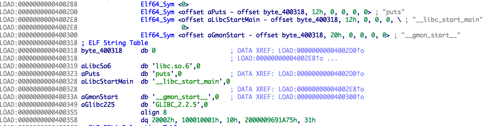
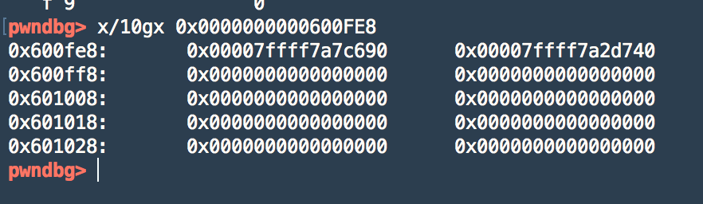
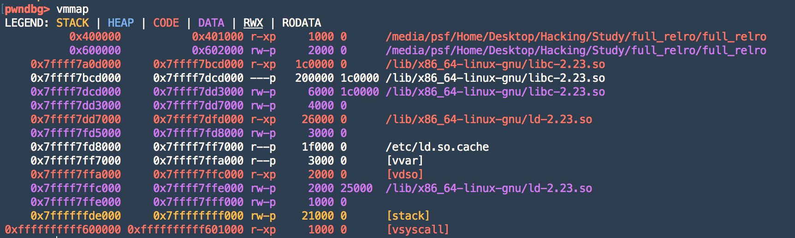
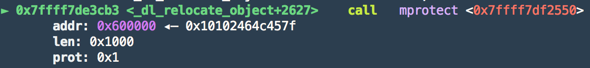

---

layout: post
title: RELRO를 파헤치자 2!
author: hOwDayS
---

<br>

전글에서는 RELRO의 기초적인 내용에 대해서 알아봤습니다!

이제 부터는 난이도가 올라갑니다!

<br>

<h1>RELRO hOw to Load Library functions ?</h1>

<br>

크게 두가지가 있습니다.

NO RELRO 와 Partial RELRO 는 불러오는 방식이 같습니다.

이번에 분석한 FULL RELRO의 방식은 많이 다릅니다!

<br>

( NO RELRO , Partial RELRO ) 와 FULL RELRO 에서 어떤 차이점이 떠오르시나요?

바로 전글에서 다룬 got의 권한 차이 입니다!

NO RELRO , Partial RELRO got에 쓰기 권한이 있지만

FULL RELRO는 없습니다.

<br>

한번 분석해보죠!!

<br>

<h2>NO RELRO , Partial RELRO</h2>

이전 plt , got 의 원리를 알아야 하는데요

전글에서 컴파일한 partial_relro 바이너리를 IDA로 열어봅시다.


저 main에서 호출 하는 puts는 plt입니다.

클릭해서 들어가게 되면


<br>

어디론가 점프하네요? 다시 클릭해서 들어가봅시다


이건 puts_got입니다! 제가 전글에서 got은 함수 라이브러리 주소를 담고있는 영역 이라고 했습니다!

그럼 puts@plt 에서는 puts@got로 jmp하는 역할을 하네요?

함수 동작원리를 눈치 채셨나요? plt 은 라이브러리 주소(got)를 가기위한 연결 통로입니다.

<br>

__그럼 라이브러리는 어떻게 불러올까요?__


<br>

아까 jmp 화면에서 shift를 누르시게 되면 밑에 또다른 코드가 있습니다.

사실 0x601018(puts_got)은 처음부터 라이브러리 주소를 가르키고 있지 않고 0x400406를 가르키고 있습니다.

라이브러리로부터 함수주소를 가져와야 되기 때문이죠!

<br>

0x400406를 살펴볼까요?

push 0(reloc_offset)

jmp sub_4003f0(Dynamic Linker)

<br>

Dynamic Linker에서는 괄호로 쳐놓은 reloc_offset을 통해서 


<br>

이 테이블로 부터 함수 정보를 가져오게 되고 가져온 정보로

<br>



Symbol테이블에서 함수의 이름 문자열을 가져오게 됩니다.

가져온 문자열 이름으로 Dynamic Linker에서는 _dl_lookup_symbol_x라는 함수를 통해

문자열을 하나씩 비교하면서 puts의 함수를 가져와서 got에 적고 puts의 함수를 실행시킵니다!.

그럼 다음부터는 got에는 라이브러리 주소가 적히게 되니 바로 라이브러리 puts함수로 jmp 하겟죠?!

<br>

자세한 내용은 https://bpsecblog.wordpress.com/2016/03/09/about_got_plt_2/ 를 참조해보세요!

<br>

동작원리입니다!


<br>

<h2>FULL RELRO</h2>

<br>

FULL RELRO의 개념을 다시 짚어 보죠.

FULL RELRO는 bss영역을 제외한 나머지(got , _DYNAMIC)의 쓰기권한을 없앤다 했습니다.

즉 , NO RELRO 나 Partial RELRO 처럼 실행하는 중간에 Dynamic Linker를 통해 got영역에 쓸 수가 없다는 말입니다!!

그럼 어떻게 불러올까요? 차근차근 지나가죠!

<br>

저번에 컴파일한 full_relro 바이너리를 IDA로 봅시다!

got영역을 살펴봅시다!


에? 뭔가 이상하지 않나요? FULL RELRO는 got영역의 Write권한이 없어야 하는데 있네요?

혹시 바이너리 시작하기전에 Dynamic Linker 를 호출하고 mprotect로 권한을 바꿔 주는게 아닐까?

 라고 생각해 볼 수 있습니다.

**Tip 바이너리는 _start라는 함수를 거쳐서 실행이 됨 , mprotect == 지정한 영역의 권한을 바꿔주는 함수

<br>

제가 이 생각을 하고 _start 함수를 쭈루룩 내려가 봤습니다.

그랬더니 뭔가 익숙한게 나오더군여 


위에서도 본 _dl_lookup_symbol_x 함수는 이름으로 비교해서 라이브러리로부터  함수를 가져오는 역할를 합니다.

뭔가 찾았으니 코드를 까보죠!

<br>

_dl_relocate_object.c 중 일부

```c
   /* String table object symbols.  */
    const char *strtab = (const void *) D_PTR (l, l_info[DT_STRTAB]);

    /* This macro is used as a callback from the ELF_DYNAMIC_RELOCATE code.  */
#define RESOLVE_MAP(ref, version, r_type) \
    ((ELFW(ST_BIND) ((*ref)->st_info) != STB_LOCAL			      \
      && __glibc_likely (!dl_symbol_visibility_binds_local_p (*ref)))	      \
     ? ((__builtin_expect ((*ref) == l->l_lookup_cache.sym, 0)		      \
	 && elf_machine_type_class (r_type) == l->l_lookup_cache.type_class)  \
	? (bump_num_cache_relocations (),				      \
	   (*ref) = l->l_lookup_cache.ret,				      \
	   l->l_lookup_cache.value)					      \
	: ({ lookup_t _lr;						      \
	     int _tc = elf_machine_type_class (r_type);			      \
	     l->l_lookup_cache.type_class = _tc;			      \
	     l->l_lookup_cache.sym = (*ref);				      \
	     const struct r_found_version *v = NULL;			      \
	     if ((version) != NULL && (version)->hash != 0)		      \
	       v = (version);						      \
	     _lr = _dl_lookup_symbol_x (strtab + (*ref)->st_name, l, (ref),   \
					scope, v, _tc,			      \
					DL_LOOKUP_ADD_DEPENDENCY, NULL);      \
	     l->l_lookup_cache.ret = (*ref);				      \
	     l->l_lookup_cache.value = _lr; }))				      \
     : l)

#include "dynamic-link.h"

    ELF_DYNAMIC_RELOCATE (l, lazy, consider_profiling, skip_ifunc);

#ifndef PROF
    if (__glibc_unlikely (consider_profiling)
	&& l->l_info[DT_PLTRELSZ] != NULL)
      {
	/* Allocate the array which will contain the already found
	   relocations.  If the shared object lacks a PLT (for example
	   if it only contains lead function) the l_info[DT_PLTRELSZ]
	   will be NULL.  */
	size_t sizeofrel = l->l_info[DT_PLTREL]->d_un.d_val == DT_RELA
			   ? sizeof (ElfW(Rela))
			   : sizeof (ElfW(Rel));
	size_t relcount = l->l_info[DT_PLTRELSZ]->d_un.d_val / sizeofrel;
	l->l_reloc_result = calloc (sizeof (l->l_reloc_result[0]), relcount);

	if (l->l_reloc_result == NULL)
	  {
	    errstring = N_("\
%s: out of memory to store relocation results for %s\n");
	    _dl_fatal_printf (errstring, RTLD_PROGNAME, l->l_name);
	  }
      }
#endif
  }

  /* Mark the object so we know this work has been done.  */
  l->l_relocated = 1;

  /* Undo the segment protection changes.  */
  while (__builtin_expect (textrels != NULL, 0))
    {
      if (__mprotect (textrels->start, textrels->len, textrels->prot) < 0)
	{
	  errstring = N_("cannot restore segment prot after reloc");
	  goto call_error;
	}

#ifdef CLEAR_CACHE
      CLEAR_CACHE (textrels->start, textrels->start + textrels->len);
#endif

      textrels = textrels->next;
    }

  /* In case we can protect the data now that the relocations are
     done, do it.  */
  if (l->l_relro_size != 0)
    _dl_protect_relro (l);
}


void internal_function
_dl_protect_relro (struct link_map *l)
{
  ElfW(Addr) start = ALIGN_DOWN((l->l_addr
				 + l->l_relro_addr),
				GLRO(dl_pagesize));
  ElfW(Addr) end = ALIGN_DOWN((l->l_addr
			       + l->l_relro_addr
			       + l->l_relro_size),
			      GLRO(dl_pagesize));
  if (start != end
      && __mprotect ((void *) start, end - start, PROT_READ) < 0)
    {
      static const char errstring[] = N_("\
cannot apply additional memory protection after relocation");
      _dl_signal_error (errno, l->l_name, NULL, errstring);
    }
}
```

으아 코드가 너무 깁니다 중요한 부분 두가지만 볼거에요

<br>

첫번째: 

 _lr = _dl_lookup_symbol_x (strtab + (*ref)->st_name, l, (ref), scope, v, _tc, DL_LOOKUP_ADD_DEPENDENCY, NULL);

이 함수를 통해 함수를 가져옵니다. 


반복문으로 끝이 있을때 까지 돌리고 하나씩 got주소에 넣습니다.



왼쪽부터 puts@got , \_\_libc\_start\_main@got 이고 모두 라이브러리를 끌어와서 주소에 넣을 것을 볼 수 있습니다.

이젠 Dynamic Linker의 역할이 끝났습니다

<br>

첫번째: 

이젠 FULL RELRO 기능 권한설정을 해야죠.

```c
 if (l->l_relro_size != 0) 
     _dl_protect_relro (l);
}


void internal_function
_dl_protect_relro (struct link_map *l)
{
  ElfW(Addr) start = ALIGN_DOWN((l->l_addr
				 + l->l_relro_addr),
				GLRO(dl_pagesize));
  ElfW(Addr) end = ALIGN_DOWN((l->l_addr
			       + l->l_relro_addr
			       + l->l_relro_size),
			      GLRO(dl_pagesize));
  if (start != end
      && __mprotect ((void *) start, end - start, PROT_READ) < 0)
```

FULL RELRO의 특징을 이용해서 _dl_protect_relro 함수를 호출해서

__mprotect ((void *) start, end - start, PROT_READ) 권한 설정을 해주는 것을 볼 수 있습니다.

<br>

gdb로 살펴보죠



mprotect 호출 전에는 권한설정이 안될걸 볼 수 있습니다.



0x600000 부터 0x601000 (0x0x600000+0x1000) 까지 , READ(0x1) 권한만 주겠다는 뜻입니다.

호출하고 나면!!


짜잔 권한이 설정된 것을 볼 수 있습니다!!!


<h1>많이 부족하지만 봐주셔서 감사합니다!!</h1>